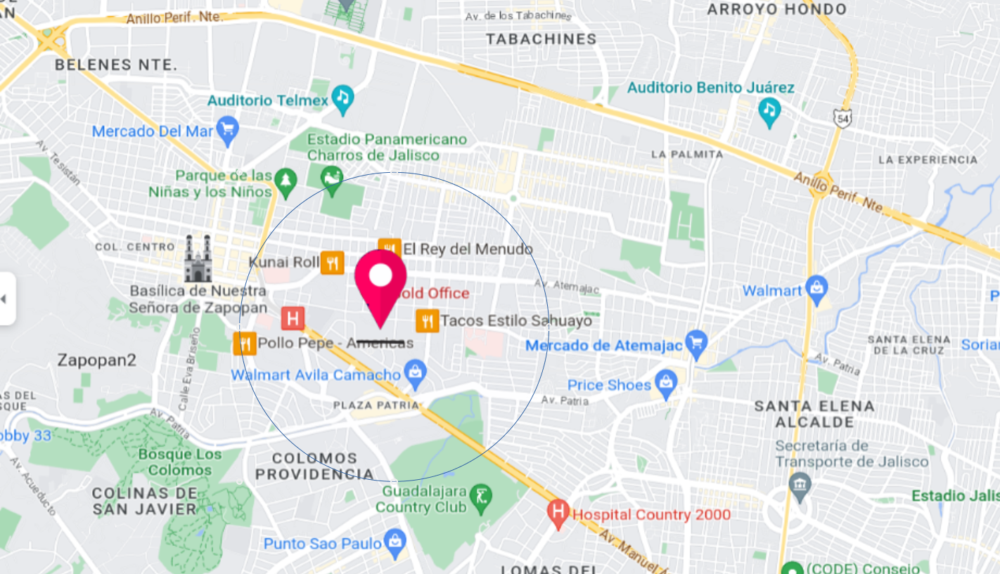

# Data enrichment 

Para que el modelo cuente con una mejor percepción del espacio, los datos fueron enriquecidos con la informacion obtenida de OpenStreetMaps, (Overpassturbo). 
Las amenidades corresponde a los servicios más comunes que busca una persona:
* **Educación**
    * school
    * kindergarten
    * college
    * university
* **Actividades ocio**
    * restaurant
    * fast_food
    * cafe
    * bar
    * ice_cream
    * cinema
    * library
* **Necesidades básias**
    * bank
    * pharmacy
    * hospital
    * marketplace
    * clinic
    * atm
    * dentist    

El modelo busca en primera instancia una relación entre el conteo de cada una de estas amenidades en un radio 1.5Km y así determina el aporte que tienen sobre el precio de la vivienda. 

# Resultados:
De
